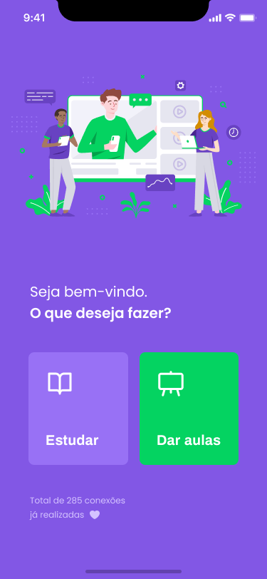

<h1 align="center"> 
    
  
   
   
</h1>

### Project made to connect teachers to students, made in Next Level Week #2 [@Rocketseat](https://rocketseat.com.br)

<h2>
 
Web
 
 
<h2>

 
 

<h2>
 
Mobile
 
 
<h2>

 

 
 
 

## 🚀 Technologies

This project was developed with the following technologies:

- ✔️ EXPO
- ✔️ React
- ✔️ React Native
- ✔️ Node JS
- ✔️ Typescript
- ✔️ Express
   

### Instagram: [@tenoriogah](https://www.instagram.com/tenoriogah)
